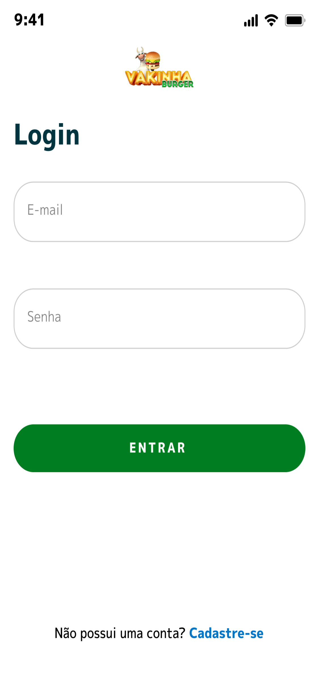
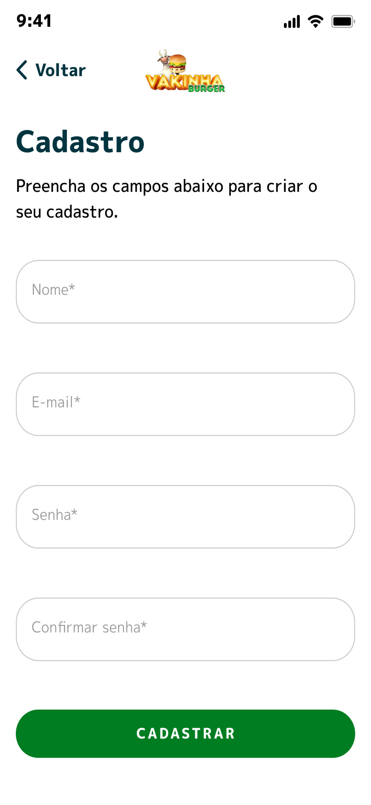
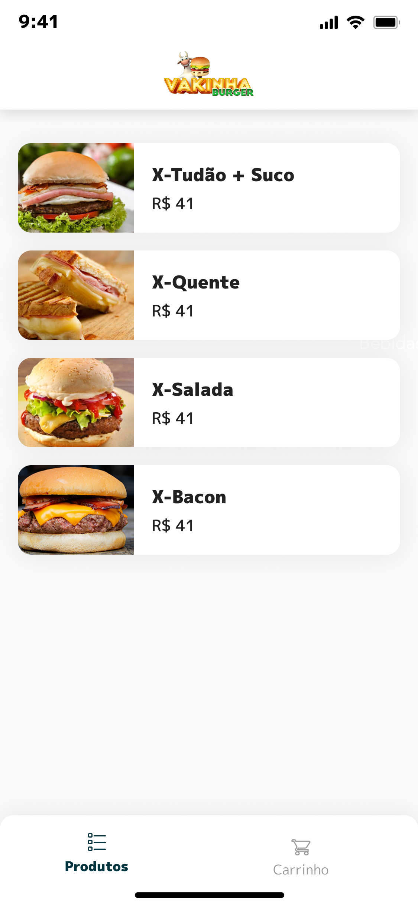
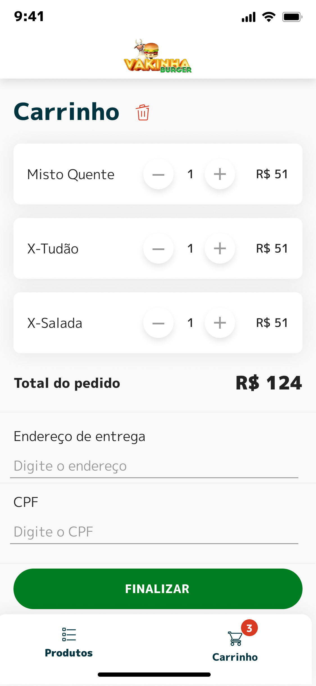
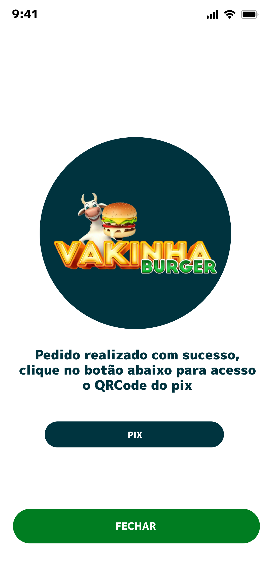
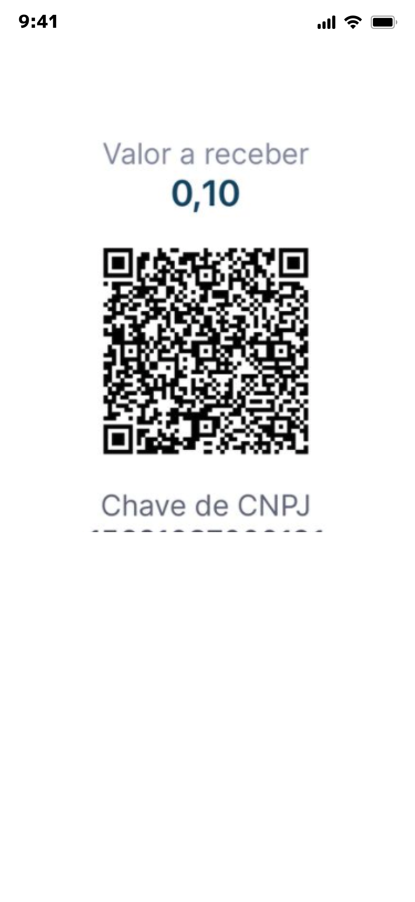

<h2>Sobre</h2>

- Em construção.

---   

<h2>Preview</h2>

<p align="center">
   
   
   
   
   
   
   
   
</p>

--- 
<h2>📦 Assets</h2>

- UI Design criado para o evento: <a href="https://www.figma.com/file/mKAFF9WKLDpD6h2jOySNcH/Vaquinha-Canal">**Vakinha Burger**</a>

> * Caso queira consultar **todos os assets do projeto**, clique <a href="https://drive.google.com/drive/folders/1phkv7hkI4XtbmCrKmAZkXm2VL7_aiiOH?usp=sharing">nesse link</a>. 

---   

<h2>🛠️ Funcionalidades e Tecnologias Estudadas</h2>

- Pagamento por PIX
- GetX como Gerenciamento de Estado
- Navigator 2.0
- Fluxo de Login e Logout com a aplicação
- Themes

- Telas: 
  - Login (Onde possui o fluxo de login)
  - Cadastro (Onde possui o cadastro do usuário)
  - Splash Page (Tela inicial do app para transição)
  - Home (Tela principal do app e que serve de fluxo inicial para as demais telas)
   </p>


---

<h2>Como usar</h2>

   ```
   Configure o ambiente de desenvolvimento na sua máquina:
   https://flutter.dev/docs/get-started/install

   - Clone o repositório:
   $ git clone https://github.com/oapmartins/vakinha_burger

   - Entre no diretório:
   $ cd vakinha_burger

   - Instale as dependências:
   $ flutter pub get

   - Execute:
   $ flutter run
   ```

---

<h2>Como contribuir</h2>

   ```
   - Fork o projeto 

   - Cria uma nova branch com suas mudanças:
   $ git checkout -b my-feature

   - Salve suas mudanças e faça uma mensagem de commit message sobre suas alterações:
   $ git commit -m "feature: My new feature"

   - Envie suas mudanças:
   $ git push origin my-feature
   ```
